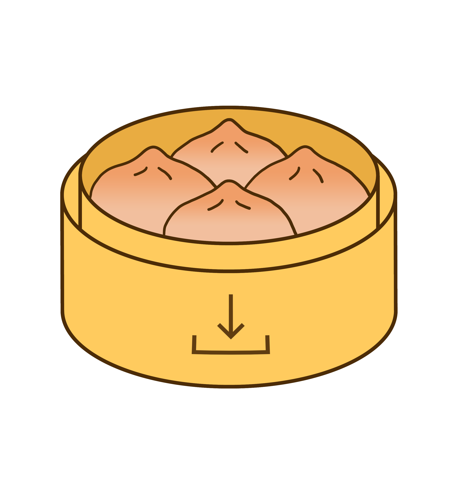

  

  <h3 align="center">Dumpling</h3>

  

    A simple Wii U file dumper, developed with the intent of making Cemu set-up faster and easier.
  

## Installation

Dumpling uses iosuhax and requires a CFW such as MochaCFW or (Coldboot) Haxchi, and won't work without it.

To install, simply download the dumpling `.zip` file from the [releases](https://github.com/emiyl/dumpling/releases/latest) page, and extract it to the root of your SD card.

## Features

- Dumps files needed for Cemu online play
  - You must dump `otp.bin` and `seeprom.bin` separately with [wiiu-nanddumper](https://github.com/koolkdev/wiiu-nanddumper)
- Dumps the Friends List app for use in Cemu
- Create region-free decrypted game disc dumps
- Dumps digital games, updates and DLC from the system or USB storage
- Dumps game saves from the system or USB storage
- Dumps the entire decrypted nand
  - This can take a very long time

## Troubleshooting

- A user reported that dumpling would freeze mid-dump. This was caused by a bad SD card. Ensure it's formatted properly before dumping.

## To-do

1. Support dumping of `otp.bin` and `seeprom.bin`
2. Multithreading to allow metadata fetching to execute in background

## Credits

- dimok789 for [ft2sd](https://github.com/dimok789/ft2sd/)
- dimok789 and FIX94 for [FTPiiU Everywhere](https://github.com/FIX94/ftpiiu/tree/ftpiiu_everywhere)
- GaryOderNichts for added support of Haxchi and other controllers
- shepgoba, rw-r-r-0644, luigoalma, vgmoose and Pysis for helping me with the project
- chrissie, Crementif and CrafterPika for testing
